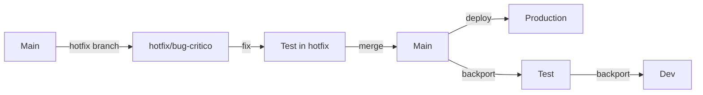

# Arquitectura - Odoo by Blink

**Versión**: 1.0
**Última actualización**: 2026-01-20
**Propósito**: Documentación de la arquitectura multi-cliente de Odoo by Blink

---

## Visión General

Odoo by Blink es una plataforma multi-cliente basada en Odoo 18 que permite gestionar múltiples clientes e instancias desde un único codebase, usando configuración por HOST.

### Principios de Diseño

1. **Un solo codebase** - Todo el código está en un repositorio único
2. **Configuración por HOST** - Cada instancia se identifica por su hostname
3. **Ramas por estado de código** - Las ramas representan estados de madurez del código, no clientes
4. **Separación código/configuración** - Código compartido, configuración específica
5. **Despliegue automatizado** - Scripts detectan HOST y cargan configuración correspondiente

---

## Diagrama de Arquitectura

```
┌─────────────────────────────────────────────────────────────────┐
│                        GIT REPOSITORY                           │
│                     github.com/Odoo-by-Blink                    │
├─────────────────────────────────────────────────────────────────┤
│                                                                 │
│  ┌──────────┐  ┌──────────┐  ┌──────────┐  ┌──────────┐      │
│  │   main   │  │   test   │  │   blink  │  │   demo   │      │
│  │  (prod)  │  │ (staging)│  │(internal)│  │ (demos)  │      │
│  └─────┬────┘  └─────┬────┘  └─────┬────┘  └─────┬────┘      │
│        │             │             │             │            │
└────────┼─────────────┼─────────────┼─────────────┼────────────┘
         │             │             │             │
         │             │             │             │
    ┌────▼─────┐  ┌────▼─────┐  ┌────▼─────┐  ┌────▼─────┐
    │ Cliente1 │  │ Cliente1 │  │  Blink   │  │   Demo   │
    │   PROD   │  │   TEST   │  │ Internal │  │ Instance │
    └──────────┘  └──────────┘  └──────────┘  └──────────┘
         │             │             │             │
    ┌────▼─────┐  ┌────▼─────┐  ┌────▼─────┐  ┌────▼─────┐
    │ Config:  │  │ Config:  │  │ Config:  │  │ Config:  │
    │ cliente1 │  │ cliente1 │  │  blink   │  │   demo   │
    │ .conf    │  │-test.conf│  │  .conf   │  │  .conf   │
    └──────────┘  └──────────┘  └──────────┘  └──────────┘
         │             │             │             │
    ┌────▼─────┐  ┌────▼─────┐  ┌────▼─────┐  ┌────▼─────┐
    │    BD:   │  │    BD:   │  │    BD:   │  │    BD:   │
    │ cliente1 │  │ cliente1 │  │  blink-  │  │   demo-  │
    │  -prod   │  │  -test   │  │ internal │  │ showcase │
    └──────────┘  └──────────┘  └──────────┘  └──────────┘
```

---

## Componentes Principales

### 1. Repositorio Git

**Ubicación**: `github.com/narellazorzon/Odoo-by-Blink`

**Ramas principales**:
- `main` - Código de producción estable
- `test` - Código en testing pre-producción
- `blink` - Desarrollo interno de Blink
- `demo` - Código para demos comerciales
- `dev` - Desarrollo activo (merges desde feature branches)

**Feature branches**:
- `feature/*` - Nuevas funcionalidades
- `bugfix/*` - Correcciones de bugs
- `hotfix/*` - Fixes urgentes para producción

### 2. Sistema de Configuración

**Estructura**:
```
config/
├── base.conf                    # Configuración base compartida
├── templates/                   # Templates para nuevos clientes
│   ├── production.template.conf
│   └── test.template.conf
└── hosts/                       # Configuraciones específicas por host
    ├── corteperfecto.somosblink.com.conf
    ├── corteperfecto-test.somosblink.com.conf
    ├── demo.somosblink.com.conf
    ├── blink.somosblink.com.conf
    └── localhost.conf
```

**Funcionamiento**:
1. Cada instancia tiene un archivo de configuración en `config/hosts/[hostname].conf`
2. Todos heredan de `config/base.conf` usando `extends = ../base.conf`
3. Valores específicos sobrescriben los valores base
4. Scripts de deployment detectan hostname y cargan configuración correspondiente

### 3. Custom Addons

**Ubicación**: `custom-addons/`

**Módulos actuales**:
- `blink_invoice_layout` - Diseño profesional de facturas para Argentina
- `blink_ar_fixes` - Fixes específicos para localización Argentina
- `l10n_ar_invoice_thermal_qr` - QR para facturas térmicas
- `web_external_layout_custom_header` - Headers customizables

**Gestión de módulos**:
- Módulos base: Compartidos por todos los clientes
- Módulos específicos: Se activan por cliente en su base de datos
- No hay módulos "por rama" - todos están en el mismo codebase

### 4. Deployment System

**Componentes**:
- `deployment/deploy.py` - Script principal de deployment
- `deployment/setup_client.sh` - Setup inicial de nuevo cliente
- `deployment/update_modules.sh` - Actualización de módulos

**Flujo**:
```bash
./deployment/deploy.py --host corteperfecto.somosblink.com --branch main
    ↓
1. Valida configuración existe
2. Verifica estado de Git
3. Checkout a rama especificada
4. Pull últimos cambios
5. Pre-deployment checks
6. Deploy código al servidor
7. Actualiza módulos (opcional)
8. Reinicia servicio
9. Health checks
10. Notificaciones
```

---

## Flujo de Trabajo

### Desarrollo de Nueva Feature


**Pasos**:
1. Crear feature branch desde `dev`: `git checkout -b feature/nueva-funcionalidad dev`
2. Desarrollar y commitear cambios
3. Push y crear Pull Request a `dev`
4. Code review y merge
5. Testing en rama `test` (deployment a instancias de test)
6. User Acceptance Testing (UAT) con clientes
7. Merge a `main` cuando esté aprobado
8. Deployment automático a producción

### Agregar Nuevo Cliente

**Proceso completo**:

1. **Preparar configuración**:
   ```bash
   # Copiar template
   cp config/templates/production.template.conf config/hosts/nuevocliente.somosblink.com.conf

   # Editar y completar valores
   vim config/hosts/nuevocliente.somosblink.com.conf

   # Crear también entorno de test
   cp config/templates/test.template.conf config/hosts/nuevocliente-test.somosblink.com.conf
   ```

2. **Documentar cliente**:
   ```bash
   # Crear documentación del cliente
   cp docs/clients/template.md docs/clients/nuevocliente.md
   vim docs/clients/nuevocliente.md

   # Actualizar mapa de hosts
   vim docs/host-environment-map.md
   ```

3. **Setup en servidor**:
   ```bash
   # SSH al servidor
   ssh usuario@servidor

   # Crear base de datos
   createdb -U odoo nuevocliente-prod

   # Crear directorios
   mkdir -p /opt/odoo/.local/share/Odoo-nuevocliente-prod
   mkdir -p /var/log/odoo

   # Copiar configuración
   scp config/hosts/nuevocliente.somosblink.com.conf servidor:/etc/odoo/

   # Crear servicio systemd
   sudo cp deployment/systemd/odoo-template.service /etc/systemd/system/odoo-nuevocliente-prod.service
   # Editar servicio para usar la configuración correcta
   sudo systemctl daemon-reload
   sudo systemctl enable odoo-nuevocliente-prod
   sudo systemctl start odoo-nuevocliente-prod

   # Configurar Nginx
   sudo cp deployment/nginx/template.conf /etc/nginx/sites-available/nuevocliente.somosblink.com
   # Editar configuración Nginx
   sudo ln -s /etc/nginx/sites-available/nuevocliente.somosblink.com /etc/nginx/sites-enabled/
   sudo nginx -t
   sudo systemctl reload nginx

   # Configurar SSL
   sudo certbot --nginx -d nuevocliente.somosblink.com
   ```

4. **Primer deployment**:
   ```bash
   ./deployment/deploy.py --host nuevocliente.somosblink.com --branch main --update-modules
   ```

5. **Validación**:
   - Acceder a https://nuevocliente.somosblink.com
   - Crear base de datos desde interfaz
   - Instalar módulos necesarios
   - Configurar según necesidades del cliente
   - Entregar accesos al cliente

### Hotfix en Producción

**Escenario**: Bug crítico en producción que necesita fix urgente



**Pasos**:
1. Crear hotfix branch desde `main`:
   ```bash
   git checkout main
   git pull origin main
   git checkout -b hotfix/descripcion-bug
   ```

2. Hacer fix y commitear

3. Testing en entorno de test usando el hotfix branch:
   ```bash
   ./deployment/deploy.py --host corteperfecto-test.somosblink.com --branch hotfix/descripcion-bug
   ```

4. Si testing OK, merge a `main`:
   ```bash
   git checkout main
   git merge hotfix/descripcion-bug
   git push origin main
   ```

5. Deployment a producción:
   ```bash
   ./deployment/deploy.py --host corteperfecto.somosblink.com --branch main --notify
   ```

6. Backport a otras ramas:
   ```bash
   git checkout test
   git merge main
   git push origin test

   git checkout dev
   git merge main
   git push origin dev
   ```

---

## Estrategia Multi-Tenant

### Enfoque Actual: Base de Datos por Cliente

Cada cliente tiene su propia base de datos PostgreSQL:
- `corteperfecto-prod`
- `corteperfecto-test`
- `nuevocliente-prod`
- etc.

**Ventajas**:
- ✅ Aislamiento completo de datos
- ✅ Backups independientes
- ✅ Escalabilidad (cada cliente puede tener su servidor si crece)
- ✅ Personalización por cliente más fácil
- ✅ Fácil de migrar clientes entre servidores

**Desventajas**:
- ❌ Más consumo de recursos
- ❌ Actualizaciones deben hacerse por cada instancia
- ❌ Más configuración inicial

### Alternativa Futura: Multi-Company

Odoo soporta múltiples empresas en una misma base de datos. Se podría considerar para:
- Clientes pequeños con necesidades similares
- Entornos demo con múltiples demos
- Reducir overhead de infraestructura

**No recomendado para**:
- Clientes grandes
- Clientes con necesidades muy específicas
- Clientes que requieran SLA alto
- Datos sensibles que no pueden compartir infraestructura

---

## Infraestructura

### Servidor Actual (Corte Perfecto)

**Especificaciones**:
- Proveedor: AWS EC2
- Sistema: Ubuntu 24.04.3 LTS
- IP Pública: 98.95.14.205
- IP Privada: 172.31.65.122

**Stack**:
- **Web Server**: Nginx (reverse proxy + SSL termination)
- **Application Server**: Odoo 18
- **Database**: PostgreSQL 14+
- **Python**: 3.11+

**Servicios**:
- `nginx` - Web server
- `postgresql` - Base de datos
- `odoo-corteperfecto` - Instancia de Odoo para Corte Perfecto
- `certbot` - Renovación automática SSL

### Escalabilidad Futura

**Horizontal** (más servidores):
```
Cliente1, Cliente2, Cliente3 → Servidor A
Cliente4, Cliente5 → Servidor B
Cliente6, Cliente7, Cliente8 → Servidor C
```

**Vertical** (más recursos):
- Incrementar CPU/RAM del servidor
- Agregar workers a configuración de Odoo
- Optimizar queries y módulos

**Load Balancing** (para clientes grandes):
```
                Load Balancer
                     │
        ┌────────────┼────────────┐
        │            │            │
    Odoo Instance1  Odoo Instance2  Odoo Instance3
        │            │            │
        └────────────┼────────────┘
                     │
             PostgreSQL (master)
                     │
        ┌────────────┼────────────┐
        │            │            │
    PG Replica1  PG Replica2  PG Replica3
```

---

## Seguridad

### Niveles de Seguridad

1. **Network**:
   - Firewall (UFW) configurado
   - Solo puertos 80, 443, 22 abiertos
   - SSH con key authentication
   - Fail2ban activo para prevenir brute force

2. **Application**:
   - Odoo corre como usuario no-privilegiado (`odoo`)
   - Proxy mode habilitado (Odoo solo escucha en localhost)
   - SSL/TLS para todas las conexiones
   - Admin password fuerte y única por instancia

3. **Database**:
   - PostgreSQL solo acepta conexiones locales
   - Contraseñas fuertes
   - Filtro de base de datos (`db_filter`) para prevenir acceso cruzado
   - Backups encriptados

4. **Code**:
   - Secrets no están en Git (usar variables de entorno)
   - Revisión de código (pull requests)
   - Dependencias actualizadas
   - Módulos custom auditados

### Manejo de Secretos

**Actual** (desarrollo/test):
- Credenciales en archivos `.conf`
- Archivos `.conf` en `.gitignore` para producción real

**Recomendado** (producción avanzada):
- Variables de entorno
- AWS Secrets Manager
- HashiCorp Vault
- Ansible Vault

**Ejemplo con variables de entorno**:
```ini
[options]
db_password = ${DB_PASSWORD}
admin_passwd = ${ADMIN_PASSWORD}
```

---

## Monitoreo y Observabilidad

### Logs

**Ubicación**:
- Odoo: `/var/log/odoo/odoo-[cliente]-[entorno].log`
- Nginx: `/var/log/nginx/[cliente]_access.log`, `[cliente]_error.log`
- PostgreSQL: `/var/log/postgresql/postgresql-14-main.log`
- Systemd: `journalctl -u odoo-[cliente]-[entorno]`

**Rotación**:
- Configurado con `logrotate`
- Retención: 30 días para producción, 7 días para test

### Métricas (Futuro)

**Herramientas sugeridas**:
- **Prometheus** + **Grafana** - Métricas y dashboards
- **Elasticsearch** + **Kibana** - Logs centralizados
- **Sentry** - Error tracking
- **UptimeRobot** - Uptime monitoring

**Métricas clave**:
- Response time
- Request rate
- Error rate
- CPU/Memory usage
- Database connections
- Disk usage
- User sessions activas

### Alertas (Futuro)

**Eventos a alertar**:
- Servicio caído
- Alta tasa de errores
- Uso de disco > 85%
- Uso de memoria > 90%
- Response time > 5s
- SSL certificate expiration

---

## Backups y Disaster Recovery

### Estrategia de Backups

**Base de datos**:
- Frecuencia: Cada 6 horas para prod, diario para test
- Retención: 30 días para prod, 7 días para test
- Método: `pg_dump` con compresión
- Ubicación: S3 bucket (encriptado)

**Filestore** (attachments, imágenes):
- Frecuencia: Diario
- Retención: 30 días
- Método: rsync o AWS S3 sync
- Ubicación: S3 bucket

**Código**:
- Git es el backup (en GitHub)
- Configuraciones: Backup semanal de `/etc/odoo/`

### Disaster Recovery Plan

**RTO** (Recovery Time Objective): 4 horas
**RPO** (Recovery Point Objective): 6 horas

**Procedimiento**:
1. Provisionar nuevo servidor EC2
2. Instalar stack (Nginx, PostgreSQL, Odoo)
3. Restaurar último backup de base de datos
4. Restaurar filestore
5. Desplegar código desde Git
6. Configurar DNS para apuntar a nuevo servidor
7. Validar funcionamiento
8. Notificar a clientes

**Script de restauración**:
```bash
./scripts/restore.sh --host corteperfecto.somosblink.com --backup-date 2026-01-20
```

---

## Performance

### Optimizaciones Aplicadas

1. **Nginx**:
   - Caching de assets estáticos (90 días)
   - Gzip compression habilitado
   - Client max body size: 100MB

2. **Odoo**:
   - Workers configurados según CPUs
   - Límites de memoria y tiempo apropiados
   - Índices en base de datos optimizados

3. **PostgreSQL**:
   - `shared_buffers` y `effective_cache_size` ajustados
   - `work_mem` optimizado
   - Autovacuum configurado

### Métricas de Performance Actuales

**Corte Perfecto (test)**:
- Response time promedio: < 500ms
- Time to first byte: < 200ms
- Database queries: < 50 por request
- Uptime: 99.5% (target: 99.9%)

---

## Próximos Pasos / Roadmap

### Corto Plazo (1-3 meses)

- [ ] Completar documentación de clientes
- [ ] Implementar script de backup automatizado
- [ ] Configurar monitoreo básico (UptimeRobot)
- [ ] Agregar 2-3 clientes más
- [ ] Optimizar performance de módulos custom

### Mediano Plazo (3-6 meses)

- [ ] Implementar CI/CD completo (GitHub Actions)
- [ ] Monitoreo avanzado (Prometheus + Grafana)
- [ ] Logs centralizados (ELK stack)
- [ ] Automatizar completamente proceso de alta de clientes
- [ ] Load testing y optimización

### Largo Plazo (6-12 meses)

- [ ] Multi-región (servidores en múltiples ubicaciones)
- [ ] Auto-scaling basado en demanda
- [ ] Disaster recovery automatizado
- [ ] Portal de self-service para clientes
- [ ] Marketplace interno de módulos custom

---

## Referencias

- **Documentación Odoo**: https://www.odoo.com/documentation/18.0/
- **Mapa de Hosts**: [`docs/host-environment-map.md`](./host-environment-map.md)
- **Guía de Deployment**: [`docs/deployment-guide.md`](./deployment-guide.md)
- **Configuraciones**: [`config/README.md`](../config/README.md)

---

**Mantenido por**: Equipo de Desarrollo Blink
**Última revisión**: 2026-01-20
